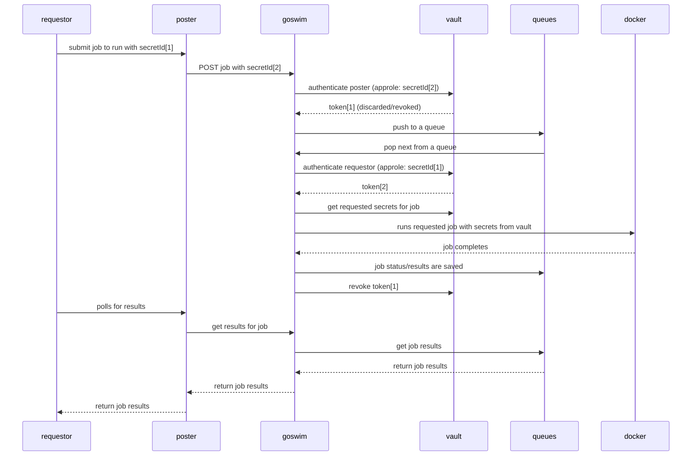

# Job Sequence Diagram

* Requestor and poster can be the same enitity, in which case secretId[1] and [2]
are the same.
* This two step authentication of requestor and poster allows for an intermediary
api routing "middleware" - in future this will be leveraged to support the
requestor posting the job details into a Vault "Cubbyhole" for goswim to pickup,
thereby removing the risk of a man-in-the-middle-attack.
