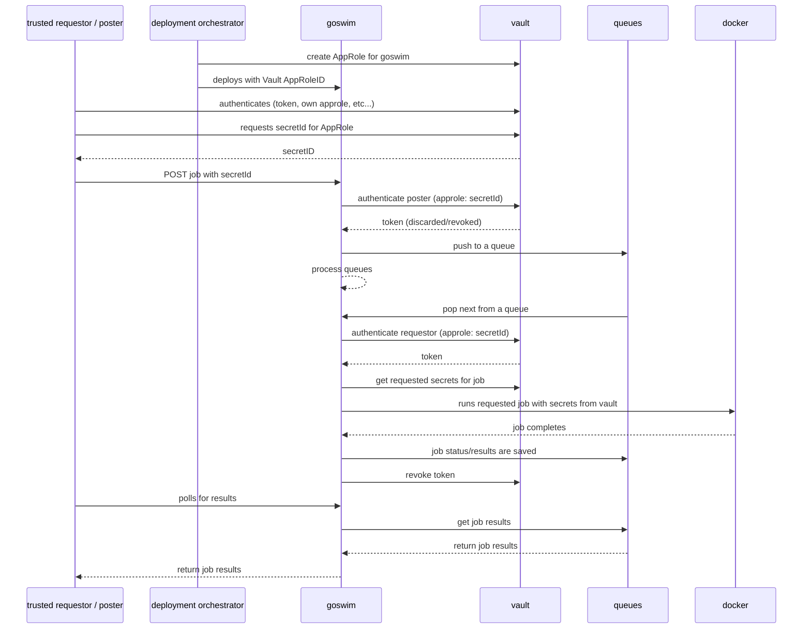
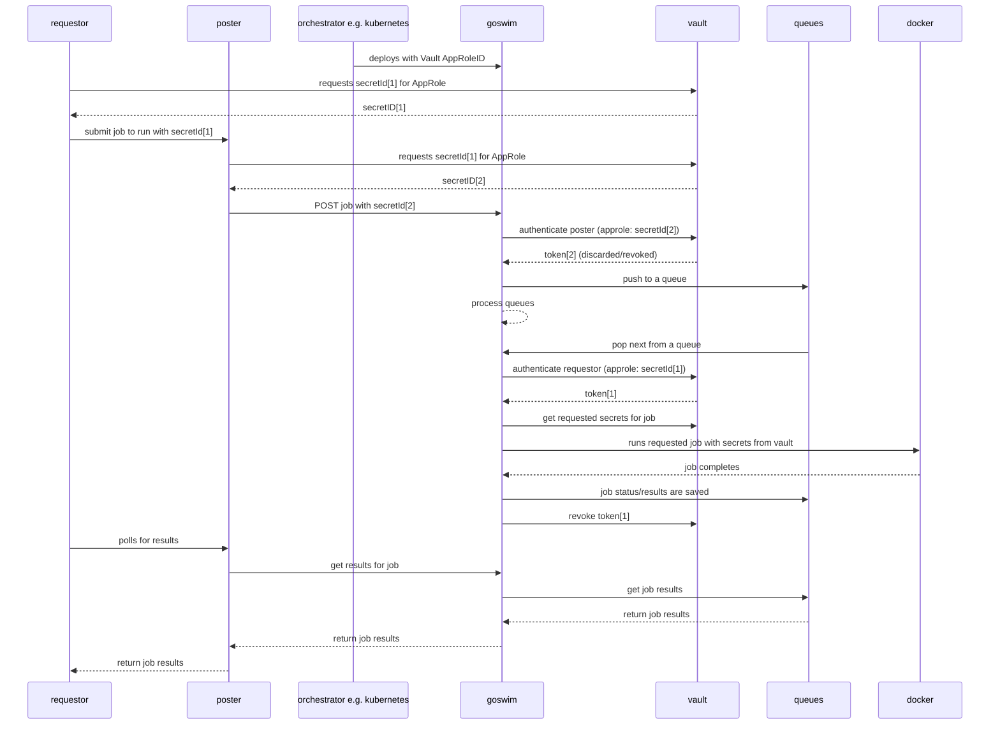
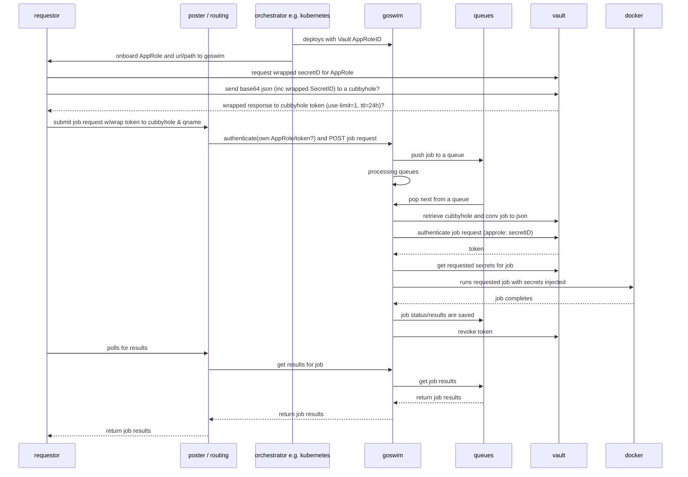
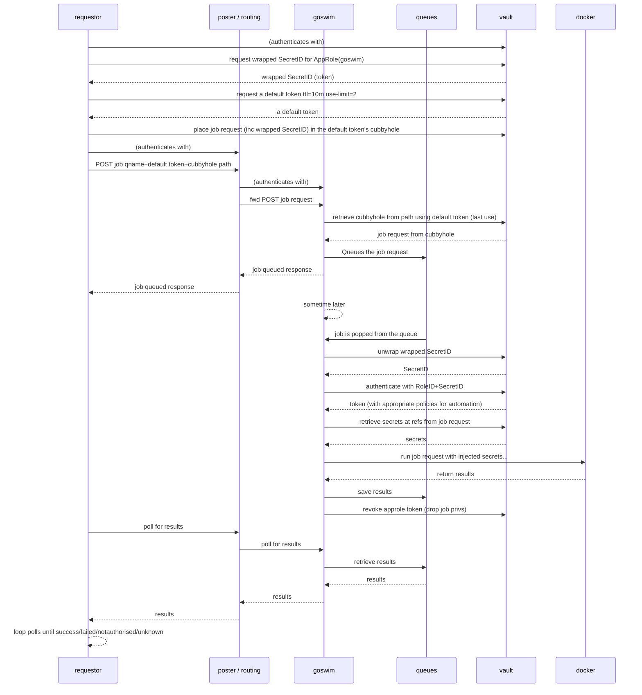

# Job Sequence Diagram
Note: to view the sequence diagrams use the Atom editor with the atom-mermaid  plugin.


* Requestor and poster here are the same enitity.

## Possible future state with Vault Cubbyhole

* This two step authentication of requestor and poster allows for an intermediary
api routing "middleware" - in future this will be leveraged to support the
requestor posting the job details into a Vault "Cubbyhole" for goswim to pickup,
thereby removing the risk of a man-in-the-middle-attack.

This diagram below includes the cubbyhole interactions:

Policy notes:
* poster must not be able to interact with cubbyholes at all.

Notes:
Creating a cubbyhole for goswim to consume
```
$ vault login root

$ vault token create -policy=default -ttl=60m -use-limit=2
Key                  Value
---                  -----
token                552d3543-ec24-ce3b-05c8-80a0a2abc799
token_accessor       59b87aac-fc4f-04d3-aaec-2560af270e03
token_duration       1h
token_renewable      true
token_policies       ["default"]
identity_policies    []
policies             ["default"]

$ VAULT_TOKEN=552d3543-ec24-ce3b-05c8-80a0a2abc799 vault write cubbyhole/test3 payload="base64 here..."
Success! Data written to: cubbyhole/test3

$ VAULT_TOKEN=552d3543-ec24-ce3b-05c8-80a0a2abc799 vault read cubbyhole/test3
Key        Value
---        -----
payload    base64 here...

$ VAULT_TOKEN=552d3543-ec24-ce3b-05c8-80a0a2abc799 vault read cubbyhole/test3
Error reading cubbyhole/test3: Error making API request.

URL: GET http://127.0.0.1:8200/v1/cubbyhole/test3
Code: 403. Errors:

* permission denied
```
AFAIK once a token is created, it is not possible to then wrap it, so this token
will need to be passed asis.

## Brainstorming options for passing job requests through an intermediary (aka the "poster")
(e.g. API GW/Lambda/Routing)

Assumption: all communications to/from the vault are direct TLS.

Though this approach can highlight/alert on tampering, it still doesnt protect
the posted job content and the AppRole SecretID.  Also it doesnt prevent the
injection of malicious content (using capture SecretID) - assuming the attacker
subverting the poster participant has sufficient vault access to create a new
cubbyhole.

Next lets look at an end-2-end encryption solution for job requests through an
intermediary using asymmetric encryption...

```mermaid
sequenceDiagram
  participant requestor
  participant poster as poster / routing
  %% participant o as orchestrator e.g. kubernetes
  participant goswim
  participant queues
  participant vault as vault transit / e2e
  participant docker

  %% Enrolement
  goswim->>vault: Enroles its RSA Public key

  %% build job to submit
  requestor->>vault: (authenticates with)
  requestor->>vault: request wrapped SecretID for AppRole(goswim)
  vault-->>requestor: wrapped SecretID (token)

  requestor->>vault: request e2e&#xb9; encryption of job payload (inc wrapped SecretID)

  requestor->>vault: request a default token ttl=10m use-limit=2
  vault-->>requestor: a default token
  requestor->>vault: place encrypted job payload in the default token's cubbyhole

  %% request job to be posted/routing
  requestor->>poster: (authenticates with)
  requestor->>poster: POST job qname+default token+cubbyhole path

  %% This time, even if the poster is hacked and intercepts the POST request,
  %% and using the default token to retrieve the cubbyhole, the data returned
  %% is encrypted, such that only goswim's RSA Private Key can decrypt it.
  %% This tampering of the request can be detected to raise an alert of the
  %% MITM attack.

  poster->>goswim: (authenticates with)
  poster->>goswim: fwd POST job request

  %% extract job from cubbyhole
  goswim->>vault: retrieve cubbyhole from path using default token (last use)
  vault-->>goswim: job request from cubbyhole

  %% we can decrypt here or at point of job execution, in this example we will
  %% leave the payload encrypted until it is needed for the job to run.

  goswim->>queues: Queues the (still encrypted) job request
  goswim-->>poster: job queued response
  poster-->>requestor: job queued response

  goswim-->>goswim: sometime later

  queues->>goswim: job is popped from the queue

  % Decrypt
  goswim->>goswim: decrypt payload with RSA private key

  goswim->>vault: unwrap wrapped SecretID (from payload)
  vault-->>goswim: SecretID
  goswim->>vault: authenticate with RoleID+SecretID
  vault-->>goswim: token (with appropriate policies for automation)
  %% this token is used by goswim going fwd and passed to running job
  goswim->>vault: retrieve secrets at refs&#xb2; from job request
  vault-->>goswim: secrets

  goswim->>docker: run job request with injected secrets...
  docker-->>goswim: return results
  goswim->>queues: save results
  goswim->>vault: revoke approle token (drop job privs)

  requestor->>poster: poll for results
  poster->>goswim: poll for results
  goswim->> queues: retrieve results
  queues-->>goswim: results
  goswim-->>poster: results&#xb3;
  poster-->>requestor: results

  requestor-->>requestor: loop polls until success/failed/notauthorised/unknown

```


[&#xb9;] e2e - this can be a multi-step process leveraging the Vault's Transit
secret engine (e.g. create a random key, encrypt payload using AES256GCM, then
encrypt the key using RSA2048 with goswim's RSA public key), or possibly use
my PoC [vault-e2e-plugin](https://github.com/gbevan/vault-e2e-plugin) for Vault.

[&#xb2;] Secret Refs could have already been resolved by the [vault-e2e-plugin](https://github.com/gbevan/vault-e2e-plugin), if used - this
could reduce the number of requests to the vault over the network.

[&#xb3;] Results passing through the intermediary poster could again be
intercepted.  If required, we could again use e2e encryption, but this time
using a requestor's own RSA key pair.

This solution gives us the best of both worlds, namely end-to-end encryption
AND tamper / interception detection during transit through the intermediary
poster / routing.

---

Copyright 2018 Graham Lee Bevan <graham.bevan@ntlworld.com>
<a rel="license" href="http://creativecommons.org/licenses/by/4.0/"></a><br />This work is licensed under a <a rel="license" href="http://creativecommons.org/licenses/by/4.0/">Creative Commons Attribution 4.0 International License</a>.

---
